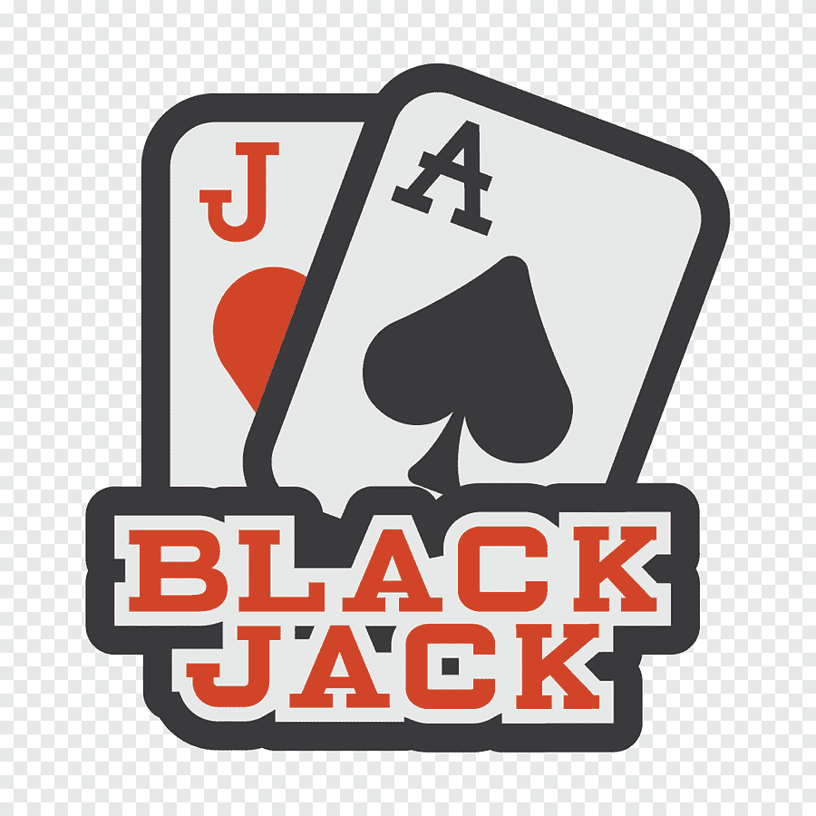

<!-- Improved compatibility of back to top link: See: https://github.com/othneildrew/Best-README-Template/pull/73 -->
<a name="readme-top"></a>
<!--
*** Thanks for checking out the Best-README-Template. If you have a suggestion
*** that would make this better, please fork the repo and create a pull request
*** or simply open an issue with the tag "enhancement".
*** Don't forget to give the project a star!
*** Thanks again! Now go create something AMAZING! :D
-->

<!-- PROJECT SHIELDS -->
<!--
*** I'm using markdown "reference style" links for readability.
*** Reference links are enclosed in brackets [ ] instead of parentheses ( ).
*** See the bottom of this document for the declaration of the reference variables
*** for contributors-url, forks-url, etc. This is an optional, concise syntax you may use.
*** https://www.markdownguide.org/basic-syntax/#reference-style-links
-->
[![Contributors][contributors-shield]][contributors-url]
[![Forks][forks-shield]][forks-url]
[![Stargazers][stars-shield]][stars-url]
[![Issues][issues-shield]][issues-url]
[![MIT License][license-shield]][license-url]
<!-- [![LinkedIn][linkedin-shield]][linkedin-url] -->

<!-- PROJECT LOGO -->
<br />
<div align="center">
  <a href="https://github.com/DanielSintimbrean/BlackJack-3.0">
    
  </a>

  <h3 align="center">BlackJack 3.0</h3>

  <p align="center">
    An awesome decentralized BlackJack!
    <br />
    <a href="https://github.com/othneildrew/Best-README-Template"><strong>Explore the docs »</strong></a>
    <br />
    <br />
    <a href="https://github.com/othneildrew/Best-README-Template">View Demo</a>
    ·
    <a href="https://github.com/othneildrew/Best-README-Template/issues">Report Bug</a>
    ·
    <a href="https://github.com/othneildrew/Best-README-Template/issues">Request Feature</a>
  </p>
</div>

<!-- TABLE OF CONTENTS -->
<details>
  <summary>Table of Contents</summary>
  <ol>
    <li>
      <a href="#about-the-project">About The Project</a>
      <ul>
        <li><a href="#built-with">Built With</a></li>
      </ul>
    </li>
    <li>
      <a href="#getting-started">Getting Started</a>
      <ul>
        <li><a href="#prerequisites">Prerequisites</a></li>
        <li><a href="#installation">Installation</a></li>
      </ul>
    </li>
    <li><a href="#usage">Usage</a></li>
    <li><a href="#roadmap">Roadmap</a></li>
    <li><a href="#contributing">Contributing</a></li>
    <li><a href="#license">License</a></li>
    <li><a href="#contact">Contact</a></li>
    <li><a href="#acknowledgments">Acknowledgments</a></li>
  </ol>
</details>

<!-- ABOUT THE PROJECT -->
## About The Project

![Product Name Screen Shot][product-screenshot]

<p align="right">(<a href="#readme-top">back to top</a>)</p>

### Built With

<br/>

<!-- * [![Next][Next.js]][Next-url]
* [![React][React.js]][React-url]
* [![Vue][Vue.js]][Vue-url]
* [![Angular][Angular.io]][Angular-url]
* [![Svelte][Svelte.dev]][Svelte-url]
* [![Laravel][Laravel.com]][Laravel-url]
* [![Bootstrap][Bootstrap.com]][Bootstrap-url]
* [![JQuery][JQuery.com]][JQuery-url] -->

 [![Solidity][Solidity.com]][Solidity-url]

 [![Hardhat][Hardhat.com]][Hardhat-url]

 [![Typescript][Typescript.com]][Typescript-url]

 [![Mocha][Mochajs.com]][Mochajs-url]

<p align="right">(<a href="#readme-top">back to top</a>)</p>

<!-- GETTING STARTED -->
## Getting Started

### Prerequisites

* Install `yarn`

```sh
  npm install --global yarn
```

* Recommended `hardhat-shorthand`

```sh
 npm install --global hardhat-shorthand
```

### Installation

* Git clone

```sh
  git clone https://github.com/DanielSintimbrean/BlackJack-3.0
```

* Install dependencies

```sh
  yarn
```

<p align="right">(<a href="#readme-top">back to top</a>)</p>

<!-- USAGE EXAMPLES -->
## Usage

### Run tests _(hardhat network)_

```sh
hh test
```

or

```sh
yarn hardhat test
```
  
<p align="right">(<a href="#readme-top">back to top</a>)</p>

<!-- CONTRIBUTING -->
## Contributing

Contributions are what make the open source community such an amazing place to learn, inspire, and create. Any contributions you make are **greatly appreciated**.

If you have a suggestion that would make this better, please fork the repo and create a pull request. You can also simply open an issue with the tag "enhancement".
Don't forget to give the project a star! Thanks again!

1. Fork the Project
2. Create your Feature Branch (`git checkout -b feature/AmazingFeature`)
3. Commit your Changes (`git commit -m 'Add some AmazingFeature'`)
4. Push to the Branch (`git push origin feature/AmazingFeature`)
5. Open a Pull Request

<p align="right">(<a href="#readme-top">back to top</a>)</p>

<!-- LICENSE -->
## License

Distributed under the MIT License.

<p align="right">(<a href="#readme-top">back to top</a>)</p>

<!-- ACKNOWLEDGMENTS -->
## Acknowledgments

Use this space to list resources you find helpful and would like to give credit to. I've included a few of my favorites to kick things off!

* [Learn Blockchain, Solidity, and Full Stack Web3 - PatrickAlphaC](https://github.com/smartcontractkit/full-blockchain-solidity-course-js)
* [Hardhat Starter Kit](https://github.com/smartcontractkit/hardhat-starter-kit)
* [GitHub Emoji Cheat Sheet](https://www.webpagefx.com/tools/emoji-cheat-sheet)
* [Img Shields](https://shields.io)

<p align="right">(<a href="#readme-top">back to top</a>)</p>

<!-- MARKDOWN LINKS & IMAGES -->
<!-- https://www.markdownguide.org/basic-syntax/#reference-style-links -->
[contributors-shield]: https://img.shields.io/github/contributors/DanielSintimbrean/BlackJack-3.0.svg?style=for-the-badge
[contributors-url]: https://github.com/DanielSintimbrean/BlackJack-3.0/graphs/contributors
[forks-shield]: https://img.shields.io/github/forks/DanielSintimbrean/BlackJack-3.0.svg?style=for-the-badge
[forks-url]: https://github.com/DanielSintimbrean/BlackJack-3.0/network/members
[stars-shield]: https://img.shields.io/github/stars/DanielSintimbrean/BlackJack-3.0.svg?style=for-the-badge
[stars-url]: https://github.com/DanielSintimbrean/BlackJack-3.0/stargazers
[issues-shield]: https://img.shields.io/github/issues/DanielSintimbrean/BlackJack-3.0.svg?style=for-the-badge
[issues-url]: https://github.com/DanielSintimbrean/BlackJack-3.0/issues
[license-shield]: https://img.shields.io/github/license/DanielSintimbrean/BlackJack-3.0.svg?style=for-the-badge
[license-url]: https://github.com/DanielSintimbrean/BlackJack-3.0/blob/master/LICENSE.txt
[linkedin-shield]: https://img.shields.io/badge/-LinkedIn-black.svg?style=for-the-badge&logo=linkedin&colorB=555
[linkedin-url]: https://linkedin.com/
[product-screenshot]: images/screenshot.png
[Solidity.com]: https://img.shields.io/badge/Solidity-444444?style=for-the-badge&logo=solidity&logoColor=white
[Solidity-url]: https://soliditylang.org/
[Hardhat.com]: images/Hardhat-url.svg
[Hardhat-url]: https://hardhat.org/
[Typescript.com]: https://img.shields.io/badge/typescript-007ACC?style=for-the-badge&logo=typescript&logoColor=white
[Typescript-url]: https://www.typescriptlang.org/
[Mochajs.com]: https://img.shields.io/badge/mochajs-8D6849?style=for-the-badge&logo=mocha&logoColor=white
[Mochajs-url]: https://mochajs.org/
